## PowerShell Basics

> You will execute the relevant PowerShell cmdlets for the tasks mentioned below and provide screenshots.

1. Get the processes that are running on the local computer. (screenshot)


2. Get all processes with a working set greater than 20 MB. (screenshot)
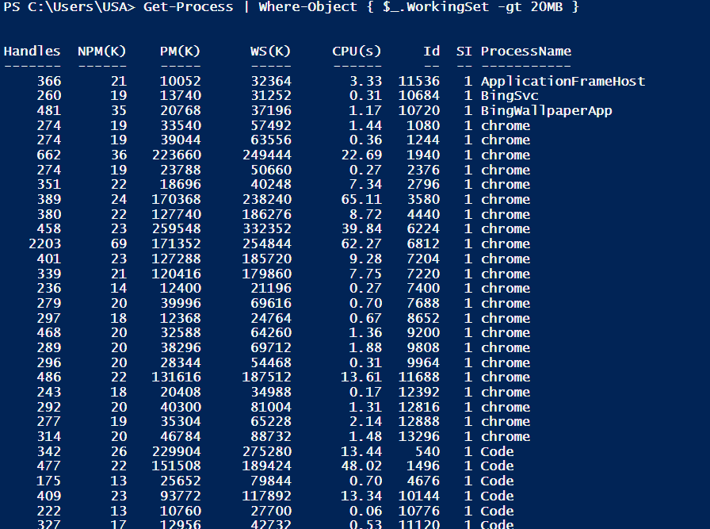


3. Find the owner of a process for example chrome. (screenshot)
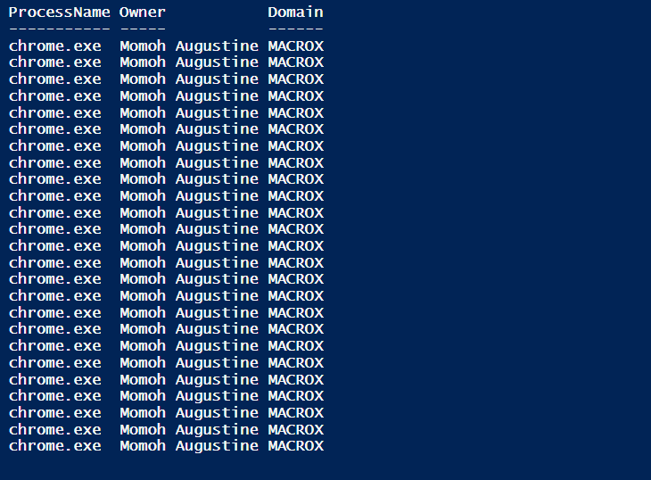

4. Stop any specific process eg. chrome.exe. (screenshot)
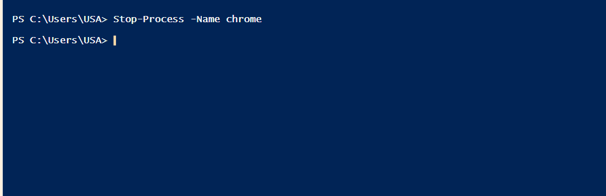


5. What cmdlets or commands can you use to clear the screen? 
    ## cls / clear 

6. Use Get-Help cmdlet to display help on Get-Process with examples. (screenshot)
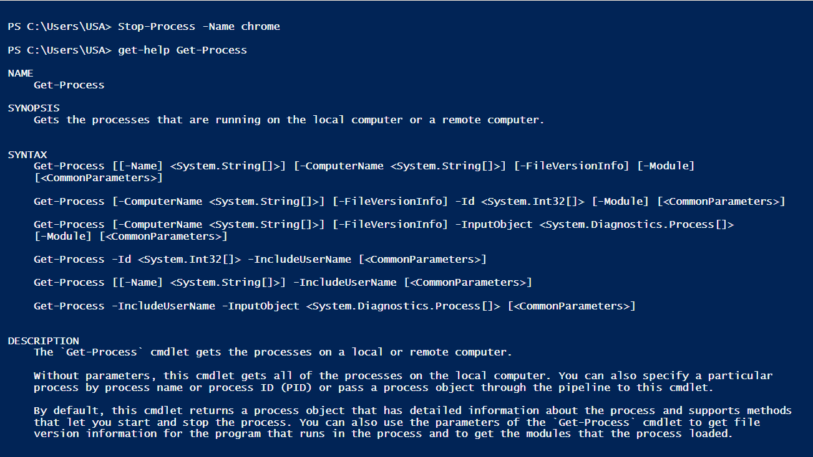

7. Check the available disk space on all drives. (screenshot)
    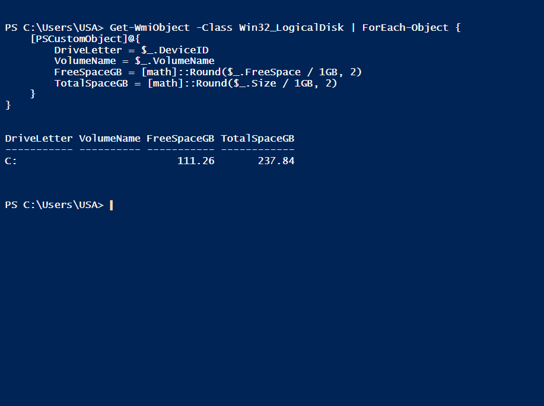

8. Display your current drive location. (screenshot)
    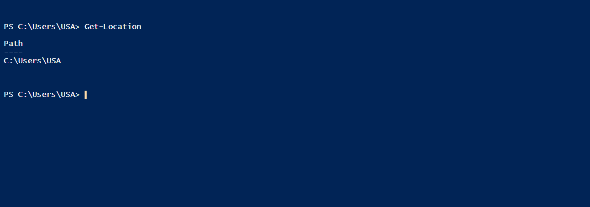

9. Get the current time zone. (screenshot)
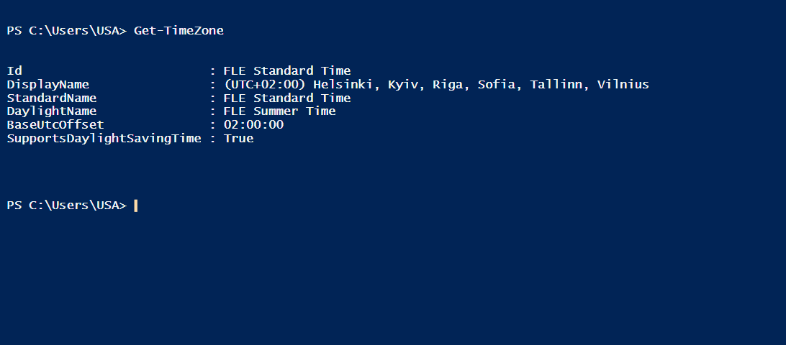


10. Get all available time zones. (screenshot)
  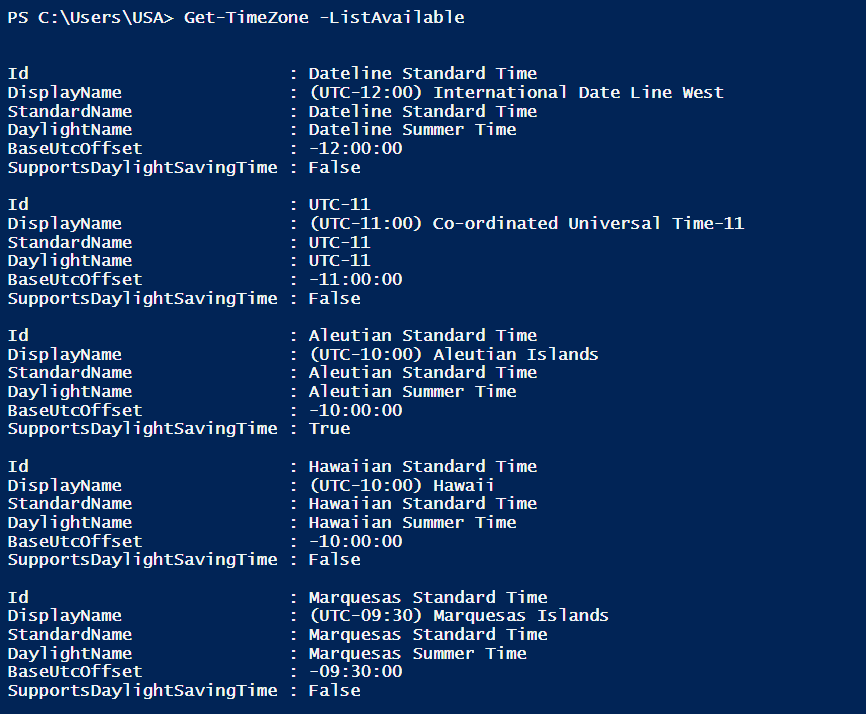


## Working with Files & Folders 

Complete the task available at this [link](https://drive.google.com/file/d/1mrJq2nvnYvBecvjSHwh8vh3Cy2Zk4VB9/view) . You don't need to submit anything for this task. 


## PowerShell cmdlets for networking tasks. 

> Practice the following basic networking PowerShell cmdlets. You are not required to submit anything for this task. I will check during the lecture that you have completed these tasks. ***Please note that you won't be able to execute all following commands.***

1. **Get-NetAdapter**:
   - Lists all network adapters on the computer.
   - Example:
     ```powershell
     Get-NetAdapter
     ```

2. **Get-NetIPAddress**:
   - Retrieves information about IP addresses assigned to network interfaces.
   - Example:
     ```powershell
     Get-NetIPAddress
     ```

3. **Get-NetRoute**:
   - Lists routing table information, including the default gateway.
   - Example:
     ```powershell
     Get-NetRoute
     ```

4. **Set-NetIPAddress**:
   - Configures the IP address, subnet mask, and default gateway for a network interface.
   - Example:
     ```powershell
     Set-NetIPAddress -InterfaceAlias "Ethernet" -IPAddress "192.168.1.100" -PrefixLength 24 -DefaultGateway "192.168.1.1"
     ```

5. **New-NetRoute**:
   - Adds a new static route to the routing table.
   - Example:
     ```powershell
     New-NetRoute -DestinationPrefix "10.0.0.0/24" -InterfaceAlias "Ethernet" -NextHop "192.168.1.1"
     ```

6. **Test-Connection**:
   - Checks network connectivity to a remote host by sending ICMP echo requests (ping).
   - Example:
     ```powershell
     Test-Connection -ComputerName "example.com"
     ```

7. **Resolve-DnsName**:
   - Resolves DNS names to IP addresses.
   - Example:
     ```powershell
     Resolve-DnsName "www.example.com"
     ```

8. **Test-NetConnection**:
   - Tests network connectivity to a remote host, including checks for open ports.
   - Example:
     ```powershell
     Test-NetConnection -ComputerName "example.com" -Port 80
     ```

9. **Get-NetFirewallProfile**:
   - Retrieves firewall profiles (e.g., domain, public, private) and their settings.
   - Example:
     ```powershell
     Get-NetFirewallProfile
     ```

10. **Enable-NetFirewallRule** / **Disable-NetFirewallRule**:
    - Enables or disables specific firewall rules.
    - Example (Enable a rule):
      ```powershell
      Enable-NetFirewallRule -Name "RemoteDesktop-UserMode-In-TCP"
      ```

11. **Get-DnsClientServerAddress**:
    - Retrieves DNS server settings for network interfaces.
    - Example:
      ```powershell
      Get-DnsClientServerAddress
      ```

12. **Set-DnsClientServerAddress**:
    - Configures DNS server addresses for network interfaces.
    - Example:
      ```powershell
      Set-DnsClientServerAddress -InterfaceAlias "Ethernet" -ServerAddresses ("8.8.8.8", "8.8.4.4")
      ```

## PowerShell Scripts

PowerShell scripts are sequences of commands and instructions written in the PowerShell scripting language. These scripts are used for automating various tasks and processes in a Windows environment.

**PowerShell Execution Policy**

To run your PowerShell scripts, you need to modify the execution policy to allow your scripts to run. 

***Type the following cmdlets below in the PowerShell to change the execution policy:*** 

```powershell
Set-ExecutionPolicy Unrestricted
Set-ExecutionPolicy RemoteSigned
``` 
Now run the script by typing the filename such as  .\filename.ps1 

Video Guides to help you with tasks: To change execution policy: https://youtu.be/YOnHgnRx28g  

**Example Script:** 

```powershell
# Get a list of running processes
$processes = Get-Process

# Display the process names and PIDs
foreach ($process in $processes) {
    Write-Host "Process Name: $($process.Name), PID: $($process.Id)"
}
```
**To run this script**

1. Write your PowerShell script using a text editor like Notepad or use Windows PowerShell ISE. 
2. Copy and paste the script.
3. Save the file with a .ps1 extension. For example, you can name it **MyScript.ps1.**
3. Get to the Script's Directory and write the following To run your script, simply enter its filename, including the .ps1 extension, and press Enter. 

```powershell
.\MyScript.ps1
```

**1. Task:** Write a script that displays the name of the computer and the ip address. (Include Screenshot of your script and the output of running your script.)

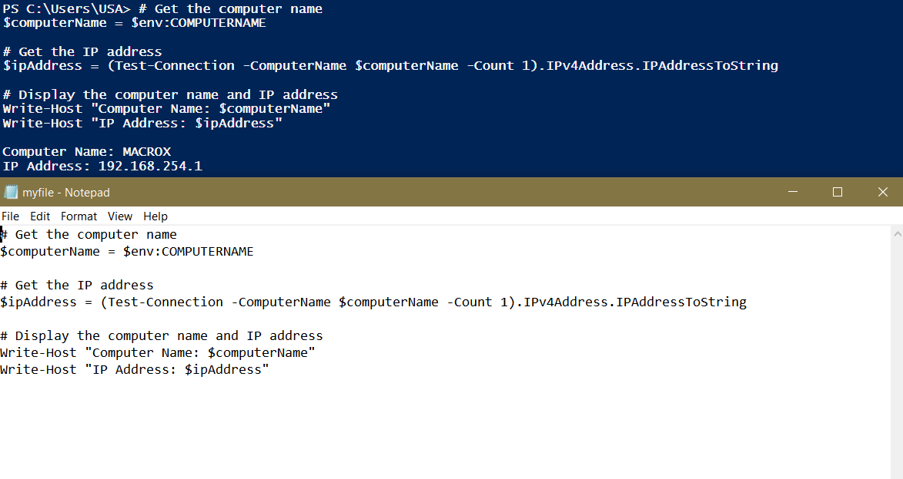


## Chocolatey Package Manager 

1. Use Chocolatey to install essential software packages on a new Windows computer, such as a web browser or any app of your interest. (include screenshot)

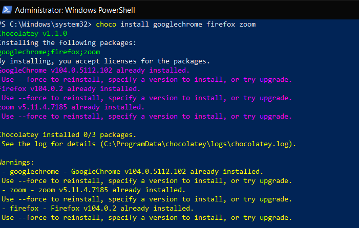


2. Use Chocolatey Package Manager to update all installed packages to their latest versions. (include screenshot)


3. Retrieve a list of all software packages installed on your computer using Chocolatey. (include screenshot)

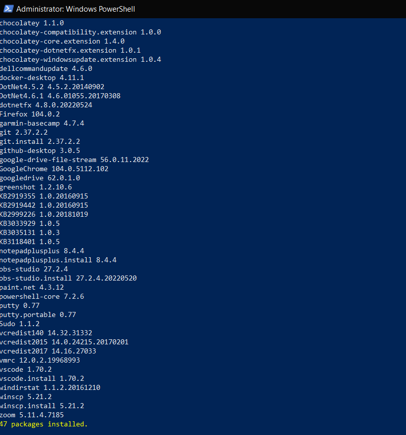


4. Search for a specific software package available on Chocolatey to see if it's in the repository. (include screenshot)

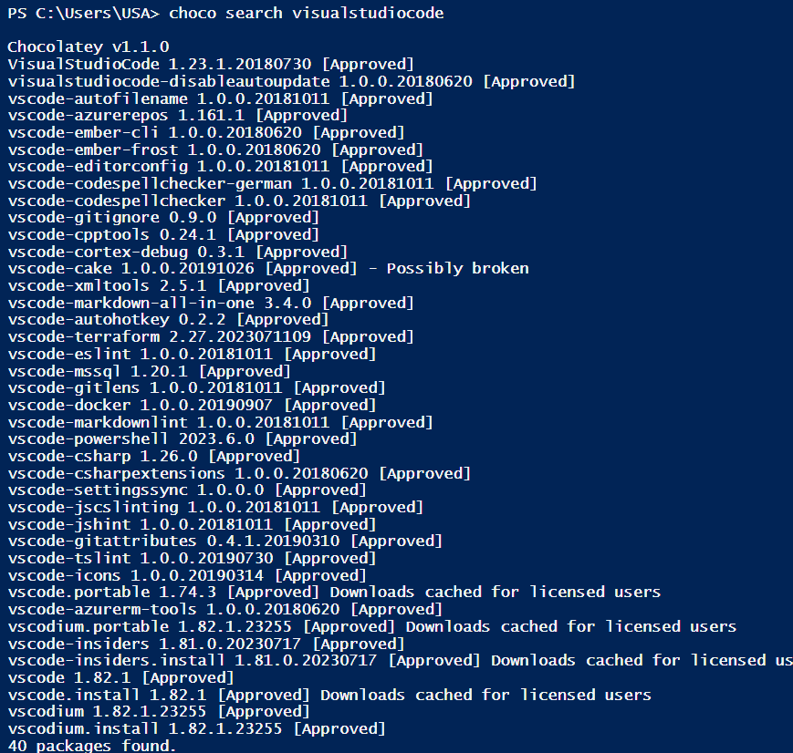


5. Uninstall the software package that you have installed above using Chocolatey. (include screenshot)
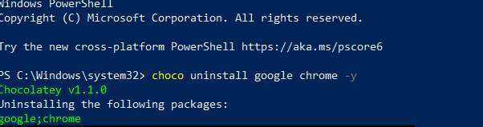

6. Create a Chocolatey installation script for a group of software packages you commonly use. (include screenshot)

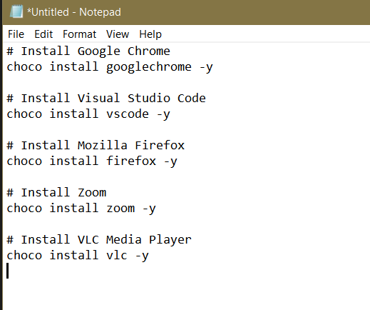

